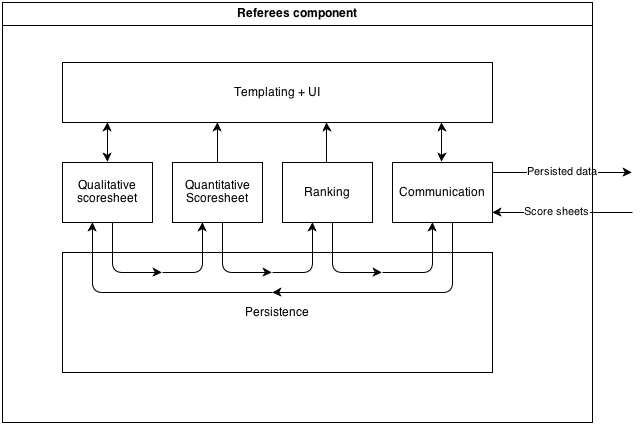

FLL Scoring architecture
========================

Glossary
--------

- System: the scoring system as a whole, i.e. everything descibed in this document
- Component: part of the system that may be identified as a separate application, serves a specific goal
- Module: isolated piece of software with minimal communication to other components. Might be developed by a single developer.

Components and modules
---------------------

Given that we need (at least) two components:

1.  Several ipad / mobile phones / paper sheets for referees / scorekeepers to log achievements
2.  One administrative pc / ipad / paper office to collect scores and calculate rankings

We identified the following requirements / modules to these components

**Referees component**

- Referee interface for qualitative scoring
- Quantitative score calculation per team
- Score persistence
- Score sorting and ranking for all teams
- Output to screen
- Device communication

**Administrative component**

- Print anything (pdf generation)
- Create scoresheets (paper or input for ipad)
- Team database coupling
- Output to screen / displays / paper / internet
- Device communication

Both components could be set up on paper, or on devices. Since this is a document describing a software architecture, we focus on the latter.

Workflow
--------

In  general, the workflow is as follows (both in software as on paper)

1.  Teams are registered
2.  A qualitative scoresheet is defined, and merged with teams producing a scoresheet for each team
3.  Competitions, qualitative scoresheets are filled in by referees
4.  A quantitative sheets transforming achievements to points is filled with the above (could be automatically), points are summed.
5.  A ranking is made with quantitative sheets for each team.
6.  The result is published, in paper, on displays or in raw data format.

Software boundaries
--------------------

We have a relatively large pool of developers, working on relatively small pieces of software (as the developers are volunteers, their time is limited). Therefore, the software needs to be highly modularized and inter module dependencies should be kept to a minimum. Furthermore, a platform should be chosen that is as accessible as possible to as many developers as possible. Hence, the use of web technologies (php, js, html, css) would be a wise choice. Note that one of the requirements of the system is to be able to run it locally / internally. This is not a constraint against using web technologies.

The system should be able to run on any hardware available. The component for referees should work on portable devices such as iPads, tablets and mobile phones. The administrative component should also work on pc's and macs. One available toolkit to create cross-device apps is [PhoneGap][1] , which allows apps to be built with html, js and css and deployed on a variety of devices. Another option is [Haxe][2], which is a language that can be compiled to various platforms . For a pc / mac solution, one could consider [[w/l/x/]amp][3]  with a browser window or something like [node-webkit][4]  or [appjs][5] . This document does not (yet) express a preference for any solution.

[1]: http://phonegap.com/
[2]: http://haxe.org/
[3]: http://www.apachefriends.org/en/xampp.html
[4]: https://github.com/rogerwang/node-webkit
[5]: https://github.com/appjs/appjs

Global architecture
------------------

###Referees component

There are 6 modules:

1.  Templating + ui: module doing all user interface work. It should be able to take view data and render it on screen. Some templating system based on html and css is advised. This layer SHOULD NOT do any business logic. Think css/[sass][6]/[less][7] and [mustache][8]/[handlebars][9]/[dustjs][10]/[angularjs][11]  as lightweight rendering systems.
2.  Qualitative scoresheet: should take a stored scoresheet from persistence and display it to the user. User input is the following
    -   Team selection by name or number
    -   Quantitative data about achieved missions

    Output is a form (rendered by the ui) and scoresheet data saved to persistence.
3.  Quantitative scoresheet: reads qualitative sheet from persistence, does calculations to come up with a quantitative sheet and total score per team. Saves this data to persistence and presents it to the user.
4.  Ranking: reads all quantitative sheets and produces a ranking per team. This is saved to persistence
5.  Persistence: Should be able to store data for a long time, recover from device shutdown or battery drain. Could be a file system, database, cookie, anything basically. It should provide an easy api for the other modules to store and retrieve data, regardless of method of storage.
6.  Communication: communicates with the outside world (administrative component), via network, optical data transfer (think qr codes) or file based transfer (usb sticks, memory cards or data cable). Wireless network may be one mode, but a second, redundant mode is advised.

Modules 2,3,4 should only communicate with the persistence module and the ui module. Module 6 (communication) should also communicate with the outside world.

Data formats for persisting data (which are presumably the same as communicated to the ui module) should yet be defined.

[6]: http://sass-lang.com/
[7]: http://lesscss.org/
[8]: http://mustache.github.io/
[9]: http://handlebarsjs.com/
[10]: http://akdubya.github.io/dustjs/
[11]: http://angularjs.org/

###Administrative component

The administrative component contains very much the same modules (as redundancy and as a way to change anything after the scores are delivered). However, there are three additional modules:

7.  Teams administration: provides a way to create a team list by combining at least a team identifier (unique) with a team name. This list is used to create team specific score sheets. Importing data may be considered.
8.  Mission definition: The hard part. This would be a way to define the parts on the quantitative scoresheet and the relations between those parts. The mission definition should contain the data to create a score sheet and the logic to calculate the qualitative scores. Furthermore, the mission definitions should be storable and transferable to the referees component. Initial thoughts were towards a [DSL][12]
9.  Printing. This could be achieved by running a rendered interface (by means of the templating module) through a headless browser like [phantomjs][13] and producing a pdf.

[12]: http://en.wikipedia.org/wiki/Domain-specific_language
[13]: http://phantomjs.org/

Contributors
------------

- [Rikkert Koppes](mailto:rikkert@rikkertkoppes.com)