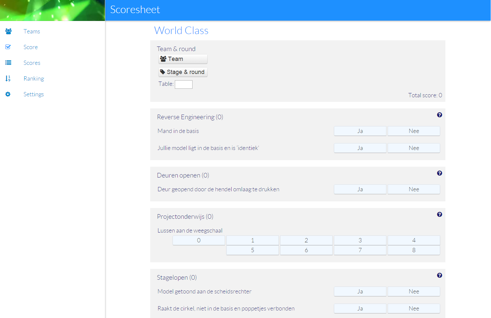
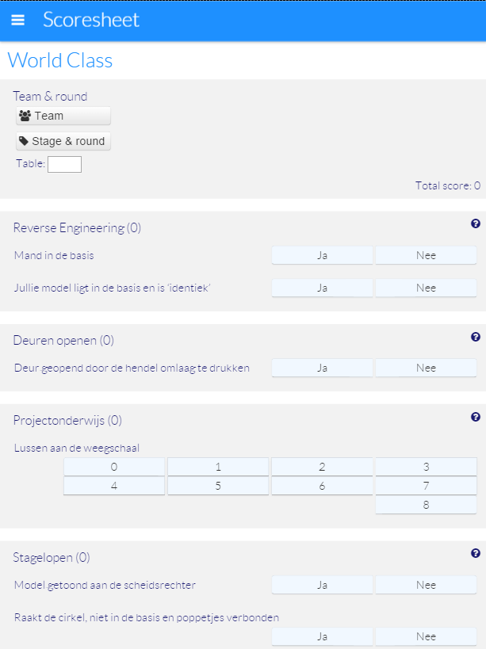
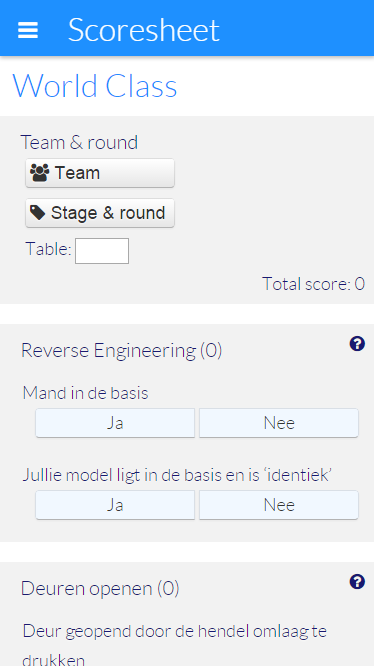
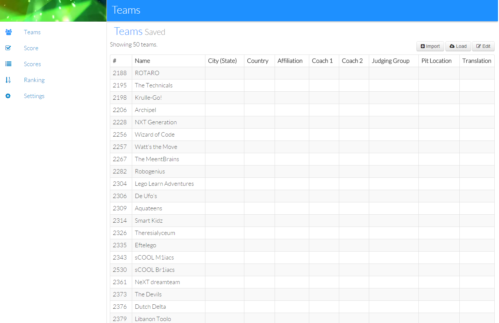
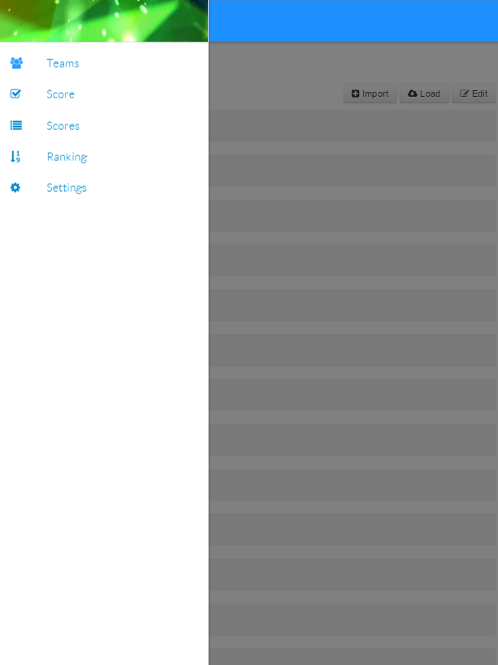
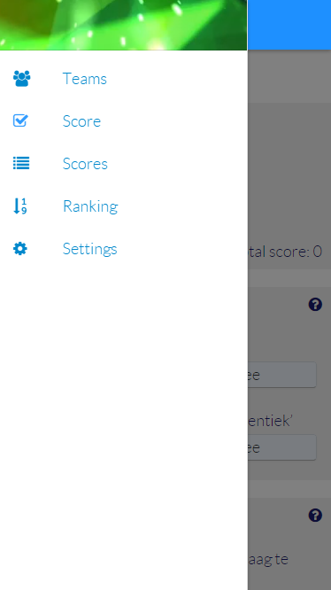
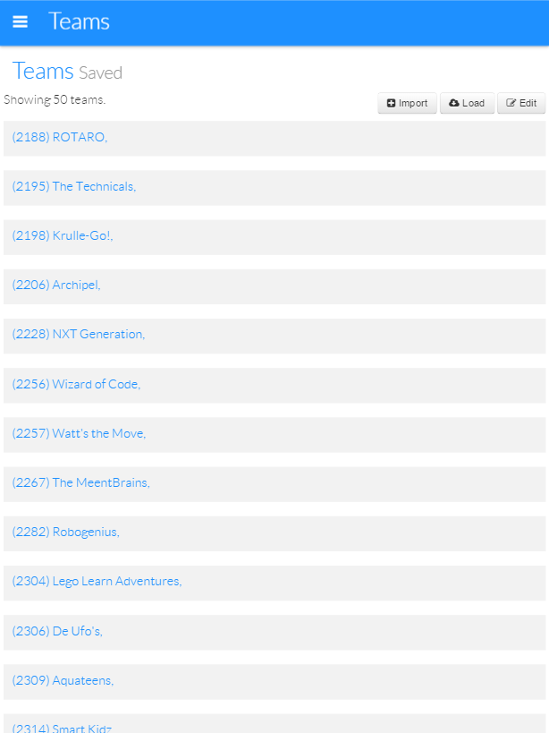

Current status screenshots
====

Material design
----

In general, we try to follow the design concepts put forward by [Google Material Design](http://www.google.com/design/spec/material-design/introduction.html)

Scalable design
---

The same design works well across a range of devices:

Desktop version of the scoring screen

Tablet version of the scoring screen

Phone version of the scoring screen

Depending on the resolution, the menu is either rendered as a sliding menu or as a static menu:

Desktop menu, always visible

Tablet menu, visible on request

Phone menu, visible on request

Team administration screen
---

The team administration screen toggles between a table-based layout and a cards-based layout

Desktop team administration

Tablet team administration
