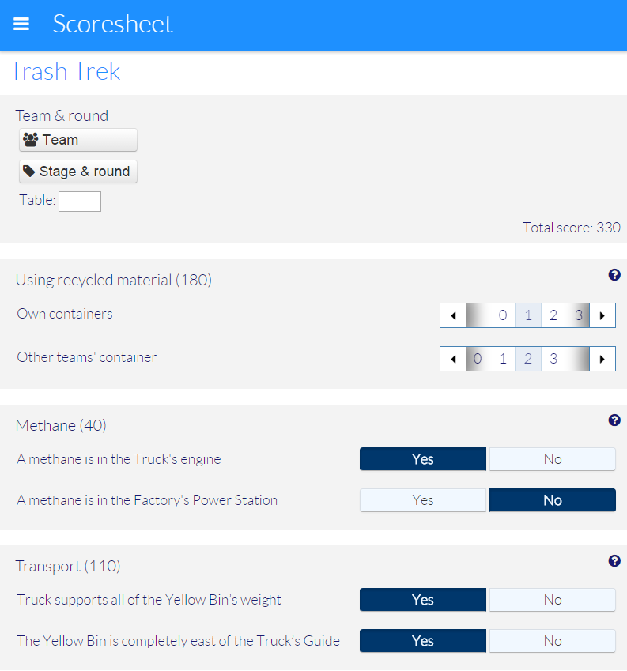

FLL Scoring
=============

To have a look at what we are at:
- see [Testing](https://github.com/FirstLegoLeague/fllscoring/wiki/Testing). No guarantees.
- or check out our live [Live demo](http://firstlegoleague.github.io/fllscoring/). Even less guarantees. 

Using
---------------

Currently the scoring application can only be reliably used as a hosted service. To use:

- set up a server running nodejs [nodejs.org](http://nodejs.org)
- [download the source](https://github.com/FirstLegoLeague/fllscoring/archive/master.zip) or clone the repository using git.
- Open a command prompt and navigate to the directory where you cloned the repository or extracted the downloaded zip-file.
- Execute the following command: `npm install`
(this installs all dependencies. It's a neccesarry step for each install)
- Run `node localserver.js` then open [localhost:1390](http://localhost:1390) in your browser
    - to specify another port, use `node localserver.js -p 8000`
    - to add basic authentication, use `node localserver.js -u username:password`

In the near future, we plan to have "ready to go" software available as:

- executable, for Windows, Mac OS and Linux
- app, for iOS, Android and windows
- a hosted service, as described above

Contributing
---------------

To contribute to this repository, please make a fork, make your changes and submit a pull request.

This way of work allows us to maintain proper code quality, which is important when working with a large amount of people on the same project. Feel free to join the discussion on the [issues page](https://github.com/FirstLegoLeague/fllscoring/issues)

The best way to work on a feature or a bug is to follow these steps:

- fork the repository to your own github account
- if already forked, make sure your fork is up to date with the base repo
- create a new branch for your feature or bugfix
- work
- test
- create a pull request to merge your development branch into a branch in the base repo
- we will review your pull request, when ok, we will merge it into master

In your own fork, you can create any branch structure you like, however, some best practices / tips are:

- use [git flow](https://jeffkreeftmeijer.com/2010/why-arent-you-using-git-flow/) to structure your branches
- keep pull requests small and concise. Try to limit a pr to only one feature / bug fix. We'd rather have many small pull requests than one large one
- keep your fork up to date with the base repo on a regular basis, by rebasing against it. This makes sure your pull requests will merge nicely

Development
---------------

Prerequisites

- nodejs [nodejs.org](http://nodejs.org). Make sure you have a recent version (>6) to get npm version >3.
- grunt (`npm install -g grunt-cli`)

Steps
------

- Clone the repository
- `npm install`

Run local
--------

This is mainly used for development.

- `node localserver.js` then open [localhost:1390/nocache.html](http://localhost:1390/nocache.html)
    - to specify another port, use `node localserver.js -p 8000`
    - to add basic authentication, use `node localserver.js -u username:password`
    - to specify a data dir use `node localserver -d datadir` Relative paths are relative to the localserver script. Absolute paths are, well, absolute. Defaults to `data`
- note that we load `nocache.html` to circumvent the offline cache mechanism

Testing
-------

- run `karma start`
- or run `grunt karma`

Building
--------

- for a desktop build: `grunt nwjs`
- for a mobile build: `grunt phonegap`
 - to build only one of iOS or Android, use `grunt phonegap:ios` or `grunt phonegap:android` respectively

For the phonegap build, copy `pgbuildconfig.example.json` to `pgbuildconfig.json` and adjust your phonegap build credentials. You can create an account on [phonegap build](http://build.phonegap.com/). Also, make sure you you copy .cordova/config.example.json to .cordova/config.json and insert your application ID from phonegap build into it. The first time you build the app you must comment the app ID line out, it will generate one for you. Afterwards check the Phonegap build website for the generated app ID.

NOTE: remove the comments in the copied file, as it is not valid JSON as it is.

For iOS, see [Building for iOS](https://github.com/FirstLegoLeague/fllscoring/wiki/Building-for-iOS)

(Only) when XML definition files have changed:
-----------------------------

- run `grunt challenge`

This will rebuild html, pdf and js versions of the challenge. This can also be done individually if you'd wish:

- run `grunt html`
- run `grunt pdf`
- run `grunt js`

These files are also included in the repo: `challenges/html`, `challenges/pdf`, `challenges/js`

Documentation
-------------

- [original proposal](docs/proposal/Scoring System project proposal-v2.pdf)
- [architecture documents](docs/architecture/readme.md)
- [templating](docs/templating/readme.md)
- [interface](docs/user_interface/readme.md)
- [internationalization](docs/i18n/readme.md)

TODO's
--------

See [case issues](https://github.com/FirstLegoLeague/fllscoring/issues?direction=desc&labels=case&page=1&sort=updated&state=open)

Help is welcome. Please comment on the case if you plan to start working on one.

License
--------
This projected is licensed under the terms of the [GNU GPL v2.0 licenses](https://raw.githubusercontent.com/FirstLegoLeague/fllscoring/master/LICENSE.txt)

Basically, it allows users to legally copy, distribute and modify software. This means you can:
* Copy it onto your own servers, your client’s servers, your own computer, pretty much anywhere you want. There’s no limit to the number of copies you can make.
* Provide a download link on your website. Put the software on a bunch of thumb drives and give them away. Print out the source code and throw it from the rooftops (please don’t, though, because that would waste a lot of paper and make a mess).
Charge a fee to distribute the software.
* If you want to charge someone to provide the software, set it up on their website or do anything else related to it, you can do so. But, you must give them a copy of the GNU GPL, which basically tells them that they could probably get the software elsewhere for free. Best to be up front about that, and about why you’re charging them.
* If you want to add or remove functionality, go ahead. If you want to use a portion of the code in another project, you can. The only catch is that the other project must also be released under the GPL. Ideally we would want you to share your improvements back with us on this GitHub.
* We welcome your feedback but please remember that this software comes with no guarantees. We are dedicated volunteer and experienced software developers and will do our best make sure we make a valuable and reliable contribution to the community. However the use of this software is at your own risk.

Authors
--------

- [Rikkert Koppes](mailto:rikkert@rikkertkoppes.com)
- [Kenny Meesters](mailto:k.meesters@gmail.com)
